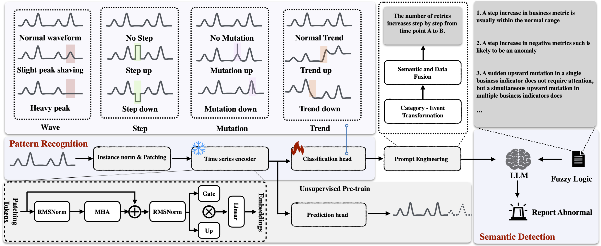

# ASE Smart Brain Code

This repository is the code artifact for our ASE 2026 paper.  It is built on
top of EasyTSAD and includes the feature-classification outputs, saved anomaly
scores, evaluation summaries, plots, and a runnable PROMOTE aggregation script
for displaying the paper results.

The most important entry point is:

```bash
python3 run_promote.py
```

It works with the folders bundled in this artifact by default and can also be
pointed at external `Results` and `Classification_trend` folders.

## Repository Layout

```text
.
├── Classification_trend/          # Four-feature classification output used by PROMOTE
│   └── trend_dataset*---Metric/
│       ├── feature_0/test_predictions.npy   # global trend feature
│       ├── feature_1/test_predictions.npy   # waveform feature
│       ├── feature_2/test_predictions.npy   # local step feature
│       └── feature_3/test_predictions.npy   # local mutation feature
├── Results/
│   ├── Evals/A_GPT/naive/         # bundled paper evaluation JSON files
│   ├── Scores/A_GPT/naive/        # saved anomaly score arrays
│   ├── Plots/score_only/          # PDF plots from the experiments
│   └── Promote/                   # generated by run_promote.py
├── EasyTSAD/                      # EasyTSAD framework code and methods
├── process_rawdata.py             # raw data preprocessing helper
├── csv_sum.py                     # result aggregation helper
├── gen_site_table.py              # table generation helper
└── run_promote.py                 # runnable multi-metric anomaly aggregation/display script
```

## Environment

Python 3.9 to 3.12 is recommended.

```bash
python3 -m venv .venv
source .venv/bin/activate
python -m pip install --upgrade pip
python -m pip install numpy matplotlib pandas scikit-learn tqdm toml
```

The default `run_promote.py` path does not require an OpenAI API key.  It uses
the same hand-coded anomaly rules described in the PROMOTE prompt so the artifact
can run offline.  LLM mode is optional.

## Show Bundled Paper Results

To print the saved paper evaluation summaries without regenerating anything:

```bash
python3 run_promote.py --show-existing
```

Expected bundled summary:

```text
Dataset                         F1(PA)  Precision  Recall  Event-F1  Event-AUPRC
-------------------------------------------------------------------------------
a_mutation                      0.9891     0.9801  1.0000    0.9048       0.8215
a_step                          1.0000     1.0000  1.0000    1.0000       1.0000
a_trend                         0.8433     0.8186  0.9843    0.6731       0.5399
a_wave                          0.7015     0.6434  1.0000    0.5566       0.3930
```

The corresponding plot PDFs are under:

```text
Results/Plots/score_only/A_GPT/naive/
```

## Regenerate and Display PROMOTE Results

Run:

```bash
python3 run_promote.py
```

This reads `Classification_trend`, groups metric curves by dataset
(`trend_dataset1` to `trend_dataset4`), detects joint anomaly indices, writes
the generated outputs, and prints the saved evaluation table.

Generated files:

```text
Results/Promote/promote_summary.md
Results/Promote/promote_summary.json
Results/Promote/promote_overview.png
Results/Promote/scores/*.npy
Results/Promote/anomaly_indices/*.json
Results/Scores/A_GPT/naive/a_promote/*---all_metrics.npy
```

Overview :



## Move Folders or Run from Another Directory

`run_promote.py` no longer assumes it is launched from the repository root.  Use
these arguments when `Results`, `Classification_trend`, or the script itself are
stored elsewhere:

```bash
python3 /path/to/run_promote.py \
  --project-root "/path/to/ASE-Smart Brain Code" \
  --classification-dir "/path/to/Classification_trend" \
  --results-dir "/path/to/Results"
```

Equivalent environment variables are also supported:

```bash
export ASE_PROJECT_ROOT="/path/to/ASE-Smart Brain Code"
export ASE_CLASSIFICATION_DIR="/path/to/Classification_trend"
export ASE_RESULTS_DIR="/path/to/Results"
python3 run_promote.py
```

Useful options:

| Option | Purpose |
| --- | --- |
| `--classification-dir` | Input folder containing `feature_*/test_predictions.npy` files. |
| `--results-dir` | Folder used for reading bundled results and writing generated outputs. |
| `--raw-data-dir` | Optional raw curve folder with `<curve>/test.npy`; missing folders are ignored. |
| `--group-by dataset` | Default. Analyze metrics jointly per `trend_dataset*`. |
| `--group-by all` | Analyze all metric curves as one combined group. |
| `--output-name` | EasyTSAD-style score subfolder under `Results/Scores/A_GPT/naive/`. |
| `--show-existing` | Only print saved evaluation summaries and plot count. |

## Optional LLM Mode

The offline mode is the reproducible default.  To use an OpenAI-compatible model
instead, install the optional dependency and set credentials:

```bash
python -m pip install openai
export OPENAI_API_KEY="your_api_key"
export PROMOTE_MODEL="your_model_name"
# Optional for compatible gateways:
export OPENAI_BASE_URL="https://your-compatible-endpoint/v1"

python3 run_promote.py --use-llm
```

LLM mode uses the same feature event descriptions and writes outputs to the same
`Results/Promote` and `Results/Scores/A_GPT/naive/a_promote` locations.

## Feature Meaning

For each metric curve under `Classification_trend/<dataset>---<metric>/`:

| Feature | Meaning | Values used by the script |
| --- | --- | --- |
| `feature_0` | Global trend | `0` stable, `1` slow increase, `2` slow decrease, `3` step increase, `4` step decrease |
| `feature_1` | Waveform state | `0/1` normal, `2` slight clipping, `3` severe clipping, `4` missing cycle |
| `feature_2` | Local step | `0` none, `1` upward step, `2` downward step |
| `feature_3` | Local mutation | `0` none, `1` upward mutation, `2` downward mutation |

The offline rule engine marks anomalies according to metric type:

- Negative metrics: `Max Latency`, `Avg Latency`, `Failure Count`,
  `Failure Rate`, `Retries`, `Timeouts`.
- Business metrics: `Request Count`, `Success Count`, `Success Rate`.
- Waveform clipping or missing cycles are anomalous.
- Local steps lasting five or fewer timestamps are ignored.
- Single-metric mutations are ignored; simultaneous multi-metric mutations are
  treated as anomalies.

## Quick Sanity Check

After setup, these two commands should succeed:

```bash
python3 run_promote.py --show-existing
python3 run_promote.py
```

The second command should produce `Results/Promote/promote_summary.md` and
`Results/Promote/promote_overview.png`, which are the fastest way to confirm that
the artifact can run and display results.
